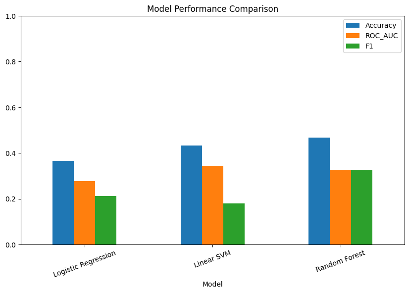
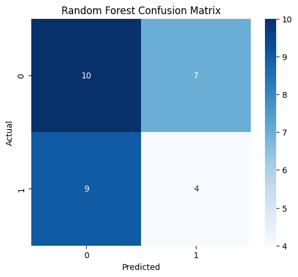
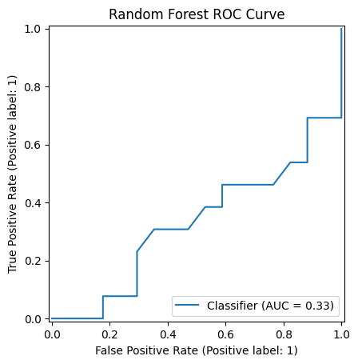
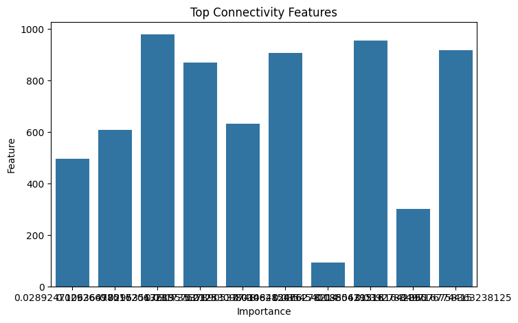

```markdown
# Advanced ADHD Classification from Resting-State Functional Connectivity

## Overview

This repository was developed as a direct methodological follow-up to a baseline ADHD classification study (Repo 3), which applied a simple logistic regression model to resting-state fMRI functional connectivity features and obtained limited predictive performance.

Rather than treating those findings as failure, this project uses them as motivation for a more rigorous second-stage analysis using expanded cohort evaluation, feature selection, and model comparison.

The repository demonstrates an iterative scientific workflow: identify limitations, redesign methodology, and reassess outcomes.

---

## From Repo 3 to Repo 4

## Baseline Study (Repo 3)

### Approach
- Logistic Regression only
- Smaller subset analysis
- Basic feature pipeline
- Single-model evaluation

### Findings
- Accuracy: 0.20
- ROC-AUC: 0.04

### Key Limitations
- Very small sample
- High-dimensional feature space
- No model benchmarking
- No feature selection
- Limited robustness

## Current Study (Repo 4)

### Improvements Introduced
- Expanded cohort usage
- Cohort audit (class balance, age, site distributions)
- SelectKBest feature selection
- Multi-model benchmarking
- Stratified cross-validation
- Feature importance analysis
- Improved result interpretation

---

## Research Question

Can methodological improvements enhance ADHD vs control classification from resting-state functional connectivity?

---

## Dataset

- Public ADHD resting-state fMRI cohort
- Multi-site participants
- ADHD and control labels
- Processed subjects used for modelling: 30

---

## Methods

### Neuroimaging Pipeline
- Harvard-Oxford atlas ROI extraction
- ROI time-series preprocessing
- Functional connectivity matrices
- Upper-triangle feature vectors

### Models Compared
- Logistic Regression
- Linear SVM
- Random Forest

### Evaluation Metrics
- Accuracy
- ROC-AUC
- F1-score
- Confusion Matrix
- ROC Curve

---

## Results

| Model | Accuracy | ROC-AUC | F1 |
|------|---------:|--------:|---:|
| Logistic Regression | 0.37 | 0.28 | 0.21 |
| Linear SVM | 0.43 | 0.34 | 0.18 |
| Random Forest | 0.47 | 0.33 | 0.33 |

## Best Model

Random Forest achieved the strongest overall balance of metrics.

---

## Figures

### Model Performance Comparison



### Random Forest Confusion Matrix



### Random Forest ROC Curve



### Top Connectivity Features



---

## Interpretation

Performance remained modest, but the project extends the baseline pipeline through more rigorous methodology and broader model evaluation.

The continued difficulty of classification likely reflects broader challenges in ADHD biomarker research, including:

- Diagnostic heterogeneity
- Site effects
- Age-related variability
- Small sample size
- Limited signal-to-noise ratio

This repository therefore emphasizes transparent evaluation and methodological learning rather than overstated predictive claims.

---

## Why This Repository Matters

This project is valuable because it demonstrates how researchers respond to weak initial findings through structured methodological refinement.

That process, rather than isolated scores, is central to real scientific progress.

---

## Future Directions

- Larger harmonised datasets
- Confound regression (age, motion, site)
- Nested cross-validation
- Explainable AI methods
- Graph-theoretic network features
- Multimodal prediction pipelines

---

## Repository Structure

repo4-advanced-adhd-classification/
- notebooks/
  - 01_data_expansion.ipynb
  - 02_connectivity_features.ipynb
  - 03_model_comparison.ipynb
  - 04_results_and_interpretation.ipynb
- figures/
- README.md

---

## Skills Demonstrated

- Computational neuroimaging
- Functional connectivity analysis
- Machine learning benchmarking
- Feature selection
- Cross-validation
- Transparent scientific reporting
- Iterative research design

---

## Author

Aditya Sundaray

Computational neuroscience portfolio project for PhD and research applications.
```
